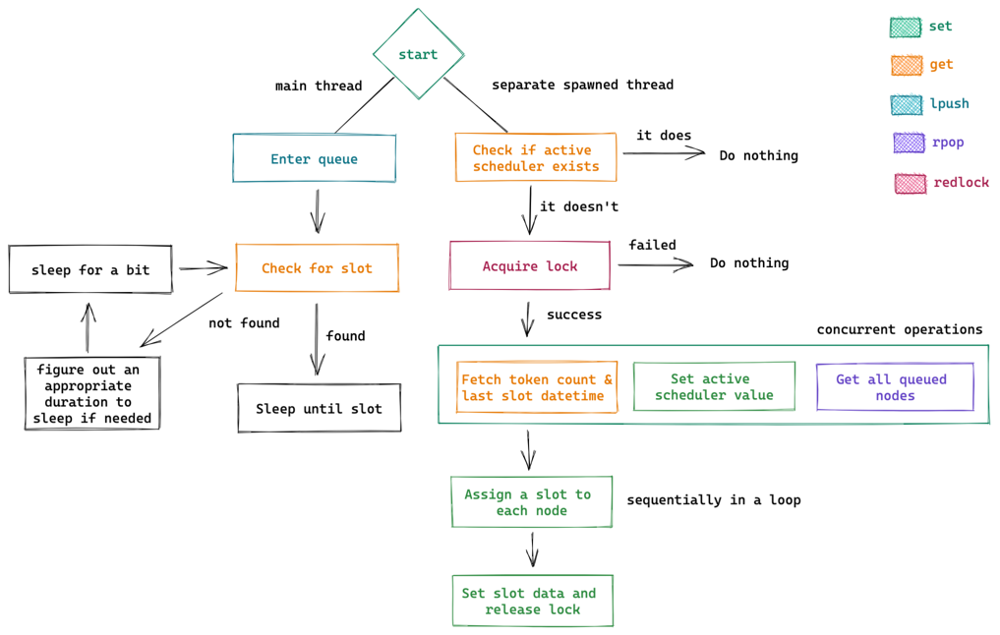

# Timely

Timely is a rate limiting library for Python. It provides a simple
interface for rate limiting, using a context manager.

The library contains one implementation for time based limiting (`n` per second)
and one for concurrency based ones (`n` at once).


## Installation

```bash
pip install timely
```

## Usage

```python
from timely import TokenBucket

# Instantiate a bucket that will allow 10 requests per minute
rate_limited_queue = TokenBucket(
    capacity=10,
    refill_frequency=60,
    refill_amount=10,
    redis_url="redis://localhost:6379"
)

while True:
    async with rate_limited_queue:
        # Send request
        ...
```

or

```python
from timely import Semaphore

async with Semaphore(
    capacity=10,
    redis_url="redis://localhost:6379"
):
    # Send request
    ...
```

## The token bucket implementation

The token bucket algorithm provides time-based rate limiting. It is
implemented in Rust, so that we can get around the
[GIL](https://realpython.com/python-gil/) and spawn an entirely separate
process/thread to perform token consumption scheduling. See
[pyo3's](https://pyo3.rs/) section on [parallelism](https://pyo3.rs/v0.16.4/parallelism.html)
for more details.

The code flow is as follows:

</img>
