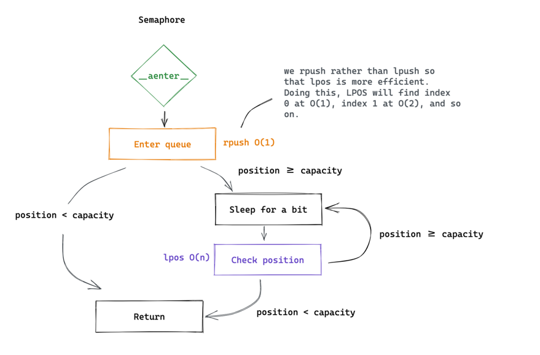
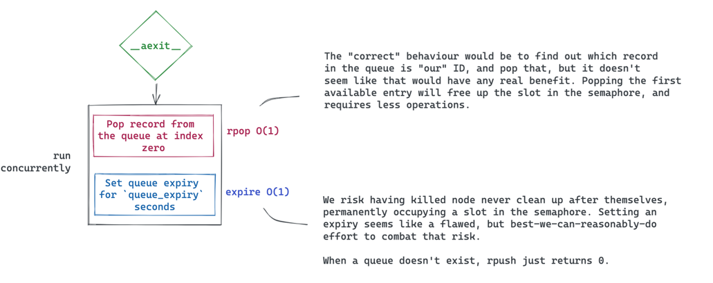

# Timely

> This is currently a work in progress. Not yet ready for use.

Timely provides a way to rate-limit your own services.

The library contains an implementation for *concurrency-based* time limits,
using a [semaphore](https://en.wikipedia.org/wiki/Semaphore_(programming)),
and an implementation for *time-based* rate limits, using implementing a
[token bucket](https://en.wikipedia.org/wiki/Token_bucket). 

The implementations are:

- Async
- Distributed
- Fair (FIFO)
- Performant

The package is written in Rust for better parallelism.

## Installation

```bash
pip install timely
```

## The semaphore implementation

The semaphore implementation is a concurrency based rate limiter.
It should be used to make sure that you e.g., don't have more than `n`
active requests to a restricted resource at the same time.

The flow goes roughly like this:

</img>

</img>

It is implemented as a context manager in Python and can be used as follows:

```python
from timely import RedisSemaphore

async with RedisSemaphore(
    name="my-api-rate-limit",
    capacity=10,
    redis_url="redis://localhost:6379"
):
    # Perform the rate-limited work immediately
    ...
```

## The token bucket implementation

The token bucket algorithm provides time-based rate limiting. By implementing
it in Rust, we're able to get around the [GIL](https://realpython.com/python-gil/) and
spawn an entirely separate process/thread to perform the work needed to assign tokens
to queued nodes (see [pyo3's](https://pyo3.rs/) section on [parallelism](https://pyo3.rs/v0.16.4/parallelism.html)
for more details).

The code flow is as follows:

</img>

It is implemented as a context manager in Python and can be used roughly as follows:

```python
from timely import RedisTokenBucket

# Instantiate a bucket that will allow 10 requests per minute
rate_limited_queue = RedisTokenBucket(
    capacity=10,
    refill_frequency=60,
    refill_amount=10,
    redis_url="redis://localhost:6379"
)

while True:
    async with rate_limited_queue:
        # Perform the rate-limited work immediately
        ...
```
