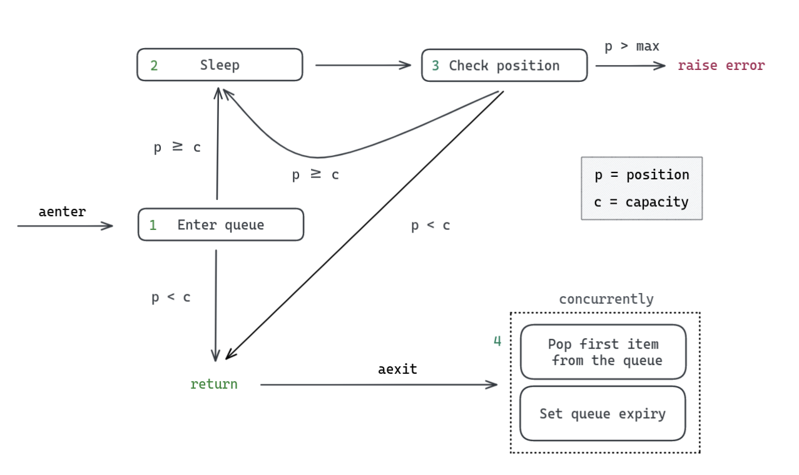
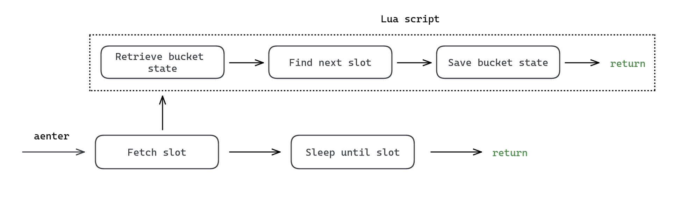

<a href="https://pypi.org/project/self-limiters/"></a>
<a href="https://github.com/snok/self-limiters/actions/workflows/publish.yml"></a>
<a href="https://codecov.io/gh/snok/self-limiters/"></a>
<a href="https://codecov.io/gh/snok/self-limiters/"></a>

# Self limiters

A library for regulating traffic with respect to **concurrency** or **time**.

It implements a [semaphore](https://en.wikipedia.org/wiki/Semaphore_(programming)) to be used when you need to
limit the number of *concurrent* requests to an API (or other resources). For example if you can at most
send 5 requests at the same time.

It also implements the [token bucket algorithm](https://en.wikipedia.org/wiki/Token_bucket) which can be used
to limit the number of requests made in a given time interval. For example if you're restricted to
sending, at most, 10 requests per second.

Both limiters are async, FIFO, and distributed using Redis. This means the limiters can be
used across several distributed processes. If that isn't your use-case, you should probably
look for another library which does this in memory.

The package was written with rate-limiting in mind, but the semaphore and token bucket
implementations can be used for anything.

# Installation

```
pip install self-limiters
```

# Usage

Both implementations are written as async context managers.

### Semaphore

The `Semaphore` can be used like this:

```python
from self_limiters import Semaphore


# 5 requests at the time
async with Semaphore(name="", capacity=5, max_sleep=60, redis_url=""):
      client.get(...)
```

The `name` given is what determines whether your processes will use the same limiter or not.

The semaphore implementation is largely a wrapper around the [`blpop`](https://redis.io/commands/blpop/)
redis command. We use it to wait for the semaphore to be freed up, in a non-blocking way.

If you specify a non-zero `max_sleep`, a `MaxSleepExceededError` will be raised if `blpop` waits for longer than that specified value.

### Token bucket

The `TokenBucket` context manager is used the same way, like this:

```python
from self_limiters import TokenBucket


# 1 requests per minute
async with TokenBucket(
        name="",
        capacity=1,
        refill_amount=1,
        refill_frequency=60,
        max_sleep=600,
        redis_url=""
):
    client.get(...)
```

The limiter first estimates when there will be capacity in the bucket - i.e., when it's this instances turn to go,
then async sleeps until then.

If `max_sleep` is set and the estimated sleep time exceeds this, a `MaxSleepExceededError`
is raised immediately.

### As a decorator

The package doesn't ship any decorators, but if you would
like to limit the rate at which a whole function is run,
you can create your own, like this:

```python
from self_limiters import Semaphore


# Define a decorator function
def limit(name, capacity):
  def middle(f):
    async def inner(*args, **kwargs):
      async with Semaphore(
              name=name,
              capacity=capacity,
              redis_url="redis://127.0.0.1:6389"
      ):
        return await f(*args, **kwargs)
    return inner
  return middle


# Then pass the relevant limiter arguments like this
@limit(name="foo", capacity=5)
def fetch_foo(id: UUID) -> Foo:
```

# Implementation and general flow

The library is written in Rust (for fun) and more importantly, relies on
[Lua](http://www.lua.org/about.html) scripts and
[pipelining](https://docs.rs/redis/0.22.0/redis/struct.Pipeline.html) to
improve the performance of each implementation.

Redis lets users upload and execute Lua scripts on the server directly, meaning we can write
e.g., the entire token bucket logic in Lua. Using Lua scripts presents a couple of nice benefits:

- Since they are executed on the redis instance, we can make 1 request to redis
  where we would otherwise have to make 3 or 4. The time saved by reducing
  the number of requests can be significant.

- Redis is single-threaded and guarantees atomic execution of scripts, meaning
  we don't have to worry about data races. As a consequence, our implementations
  become FIFO out of the box. Without atomic execution we'd need distributed locks to prevent race conditions, which would
  be very expensive.

So Lua scripts help make our implementation faster and simpler.

This is the rough flow of execution, for each implementation:

### The semaphore implementation

1. Run a [lua script](https://github.com/snok/self-limiters/blob/main/scripts/semaphore.lua)
   to create a list data structure in redis, as the foundation of the semaphore.

   This script is idempotent, and skipped if it has already been created.

2. Run [`BLPOP`](https://redis.io/commands/blpop/) to non-blockingly wait until the semaphore has capacity,
   and pop from the list when it does.

3. Then run a [pipelined command](https://github.com/snok/self-limiters/blob/main/src/semaphore.rs#L78:L83)
   to release the semaphore by adding back the capacity borrowed.

So in total we make 3 calls to redis, which are all non-blocking.

### The token bucket implementation

The token bucket implementation is even simpler. The steps are:

1. Run a [lua script](https://github.com/snok/self-limiters/blob/main/scripts/token_bucket.lua)
   to estimate and return a wake-up time.

2. Sleep until the given timestamp.

We make one call, then sleep. Both are non-blocking.

---------

So in summary, almost all of the time is spent waiting for async i/o, meaning the limiters' impact on an
application event-loop should be close to completely negligible.

## Benchmarks

We run benchmarks in CI with Github actions. For a normal `ubuntu-latest` runner, we see runtimes for both limiters:

When creating 100 instances of each implementation and calling them at the same time, the average runtimes are:

- Semaphore implementation: ~0.6ms per instance
- Token bucket implementation: ~0.03ms per instance

Take a look at the [benchmarking script](https://github.com/snok/self-limiters/blob/main/src/bench.py) if you want
to run your own tests!

# Implementation reference

## The semaphore implementation

The semaphore implementation is useful when you need to limit a process
to `n` concurrent actions. For example if you have several web servers, and
you're interacting with an API that will only tolerate a certain amount of
concurrent requests before locking you out.

The flow can be broken down as follows:

</img>

The initial [lua script](https://github.com/snok/self-limiters/blob/main/scripts/semaphore.lua)
first checks if the redis list we will build the semaphore on exists or not.
It does this by calling [`SETNX`](https://redis.io/commands/setnx/) on the key of the queue plus a postfix
(if the `name` specified in the class instantiation is "my-queue", then the queue name will be
`__self-limiters:my-queue` and setnx will be called for `__self-limiters:my-queue-exists`). If the returned
value is 1 it means the queue we will use for our semaphore does not exist yet and needs to be created.

It might strike you as weird to maintain a separate value, just to indicate whether a list exists,
when we could just check the list itself. It would be nice if we could use
[`EXISTS`](https://redis.io/commands/exists/) on the list directly, but unfortunately a list is considered
not to exist when all elements are popped (i.e., when a semaphore is fully acquired), so I don't see
another way of doing this. Contributions are very welcome if you do!
<br><br>
Then if the queue needs to be created we call [`RPUSH`](https://redis.io/commands/rpush/) with the number of arguments
equal to the `capacity` value used when initializing the semaphore instance. For a semaphore with
a capacity of 5, we call `RPUSH 1 1 1 1 1`, where the values are completely arbitrary.

Once the list/queue has been created, we [`BLPOP`](https://redis.io/commands/blpop/) to block until it's
 our turn. `BLPOP` is FIFO by default. We also make sure to specify the `max_sleep` based on the initialized
 semaphore instance setting. If nothing was passed we allow sleeping forever.

On `__aexit__` we run three commands in a pipelined query. We [`RPUSH`](https://redis.io/commands/rpush/) a `1`
back into the queue to "release" the semaphore, and set an expiry on the queue and the string value we called
`SETNX` on.
<br><br>
The expires are a half measure for dealing with dropped capacity. If a node holding the semaphore dies,
the capacity might never be returned. If, however, there is no one using the semaphore for the duration of the
expiry value, all values will be cleared, and the semaphore will be recreated at full capacity next time it's used.
The expiry is 30 seconds at the time of writing, but could be made configurable.

### The token bucket implementation

The token bucket implementation is useful when you need to limit a process by
a time interval. For example, to 1 request per minute, or 50 requests every 10 seconds.

The implementation is forward-looking. It works out the time there *would have been*
capacity in the bucket for a given client and returns that time. From there we can
asynchronously sleep until it's time to perform our rate limited action.

The flow can be broken down as follows:

</img>

Call the [schedule Lua script](https://github.com/snok/self-limiters/blob/main/scripts/token_bucket.lua)
which first [`GET`](https://redis.io/commands/get/)s the *state* of the bucket.

The bucket state contains the last time slot scheduled and the number of tokens left for that time slot.
With a capacity of 1, having a `tokens_left_for_slot` variable makes no sense, but if there's
capacity of 2 or more, it is possible that we will need to schedule multiple clients to the
same time slot.

The script then works out whether to decrement the `tokens_left_for_slot` value, or to
increment the time slot value wrt. the frequency variable.

Finally, we store the bucket state again using [`SETEX`](https://redis.io/commands/setex/).
This allows us to store the state and set expiry at the same time. The default expiry
is 30 at the time of writing, but could be made configurable.

One thing to note, is that this would not work if it wasn't for the fact that redis is single threaded,
so Lua scripts on Redis are FIFO. Without this we would need locks and a lot more logic.

Then we just sleep!

# Contributing

Please do! Feedback on the implementation, issues, and PRs are all welcome. See [`CONTRIBUTING.md`](https://github.com/snok/self-limiters/blob/main/CONTRIBUTING.md) for more details.

Please also consider starring the repo to raise visibility.
