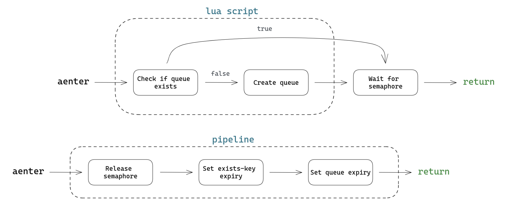

<br>
<p align="center">
<a href="https://github.com/snok/self-limiters"></a>
<br>
<b>Distributed async rate limiters</b>
<br><br>
<a href="https://pypi.org/project/self-limiters/"></a>
<a href="https://github.com/sondrelg/self-limiters/actions/workflows/publish.yml"></a>
<a href="https://codecov.io/gh/sondrelg/self-limiters/"></a>
</p>


<br>

> This is currently a work in progress.

Traffic lights is a library for client rate limiting. More specifically, it's a project for rate limiting your
Python applications if you're running an async stack and redis.

The scope of the library is pretty small. All it does is provide a way to police traffic for:

- Concurrency based limits, using a distributed [semaphore](https://en.wikipedia.org/wiki/Semaphore_(programming)) (e.g., `n` allowed requests at once)
- Time based limits, using a distributed [token bucket](https://en.wikipedia.org/wiki/Token_bucket) (e.g., `n` allowed requests per minute)

Parts of the logic are implemented using Lua scripts, run _on_ the redis instance.
This makes it possible to do the same work in one request, that would otherwise take 4. This eliminates the latency
of each request we've saved, while letting us free up the event-loop to do other things for the duration.
The overhead if both rate limiters should in other words be completely negligible :rocket:

## Installation

```bash
pip install traffic-lights
```

## The semaphore implementation

The semaphore implementation is useful when you need to limit a process
to `n` actions at the same time.

In terms of fairness, the semaphore implementation skews towards
FIFO, but is opportunistic. A worker will not be allowed to run until
there is capacity assigned to them, specifically; but the order of
execution is not guaranteed to be exactly FIFO.

The flow goes roughly like this:

</img>

<details>
<summary><b>Flow breakdown</b></summary>
<ol>
<li>Enter queue (<a href="https://redis.io/commands/rpush/">RPUSH</a>*) and get the queue position.

*<small>When using RPUSH, <a href="https://redis.io/commands/lpos/">LPOS</a> will find the first index at O(1),
and the second at O(2), and so on. By using this combination, we're prioritizing quicker access at lower indexes.</small>
</li>
<li>
How long to sleep for depends on our position in the queue. If the capacity of the semaphore is 10, and we are position 15,
then we need 5 places to be freed up before it's our turn. In this case, we sleep 5 * `sleep_duration`, which is 100ms
by default and can be specified when instantiating the Semaphore class.
</li>
<li>
Check our position (<a href="https://redis.io/commands/lpos/">LPOS</a>) and raise an error if the position exceeds
the maximum allowed position (none, by default).
</li>
<li>
After running the rate limited code, we need to clean up the queue entry we added.
We could use a distributed lock to check our position and pop the right index, but that seems needlessly inefficient. Instead, we
just pop the first index, since this will free up capacity in the semaphore for the next process.

There is a potential issue where capacity will never be freed if a process crashes before running aexit. To remedy
this slightly, we specify that the queue should expire after a short period of inactivity.
</li>
</ol>
</details>

### Usage

The utility is implemented as a context manager in Python. Here is an example of a semaphore which will allow 10 concurrent requests:

```python
from tl import Semaphore


# Instantiate a semaphore that will allow 10 concurrent requests
concurrency_limited_queue = Semaphore(
    name="unique-resource-name",
    capacity=10,
    redis_url="redis://localhost:6379"
)

while True:
    async with concurrency_limited_queue:
        client.get(...)
```

## The token bucket implementation

The token bucket implementation is useful when you need to limit a
process to a certain number of actions per unit of time. For
example, 1 request per minute.

This implementation, unlike the semaphore algorithm, does not rely on continuous polling to see whether there is
capacity or not. Instead, we let a scheduler process work out *when* a token would have been added for each node
in the queue, and let the nodes sleep until it's time to consume their token. The aim is to minimize i/o and maximize
sleep, as sleeping asynchronously frees up the event loop to do other things.

The code flow goes:

</img>

By implementing parts of the logic in a [Lua](https://www.lua.org/) script, we're able to get great
performance, and reduce i/o. Since redis is single-threaded, scripts are considered atomic,
which also reduces complexity greatly.

### Usage

This is also implemented as a context manager in Python and can be used roughly as follows:

```python
from tl import TokenBucket

# Instantiate a bucket that will allow 10 requests per minute
time_limited_queue = TokenBucket(
    name="unique-resource-name",
    capacity=10,
    refill_frequency=60,
    refill_amount=10,
    redis_url="redis://localhost:6379"
)

while True:
    async with time_limited_queue:
        # Perform the rate-limited work immediately
        client.get(...)
```


## Benchmarks

When testing locally:

- processing 100 nodes with the semaphore implementation takes ~13ms
- processing 100 nodes with the token bucket implementation takes ~7ms


## Contributing

### Debugging Lua scripts

Assuming you have a redis server running at `:6389` you can debug
a lua script by calling `redis-cli -u redis://127.0.0.1:6389 --ldb --eval src/semaphore/rpushnx.lua x 1`.

Just type `help` in the debugger for options.
